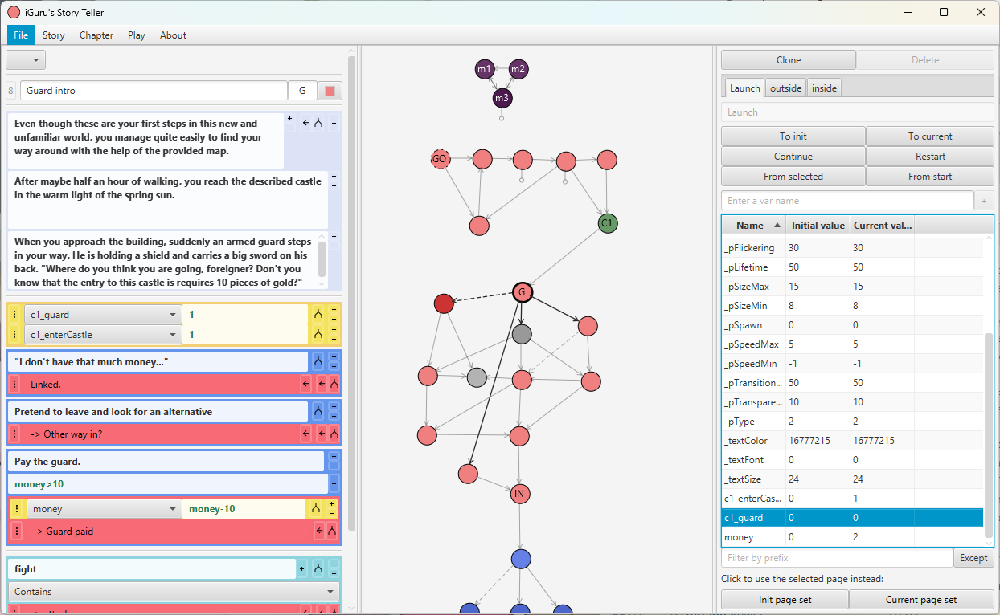

# StoryTeller

_A simple Text Adventure engine I started when I finished high school. The plans were huge, the amount of work and classes here is kind of surprising, still the StoryTeller is in an early state._

As I still have some ideas for such text adventures in my mind, maybe one day I'll come back to this project and bring it into shape. Right now it is not even possible to load game files from the GUI (even though both level files and save stats can somehow be written and read). 

This is glimpse of what the StoryTeller looks like right now, and what is implemented at the moment - we even have a variable system including a small compiler for writing and checking formulas. Also, the player always has the option to *type* further actions instead of selecting one of the offered options to discover hidden paths and alternative solutions to puzzles. 

